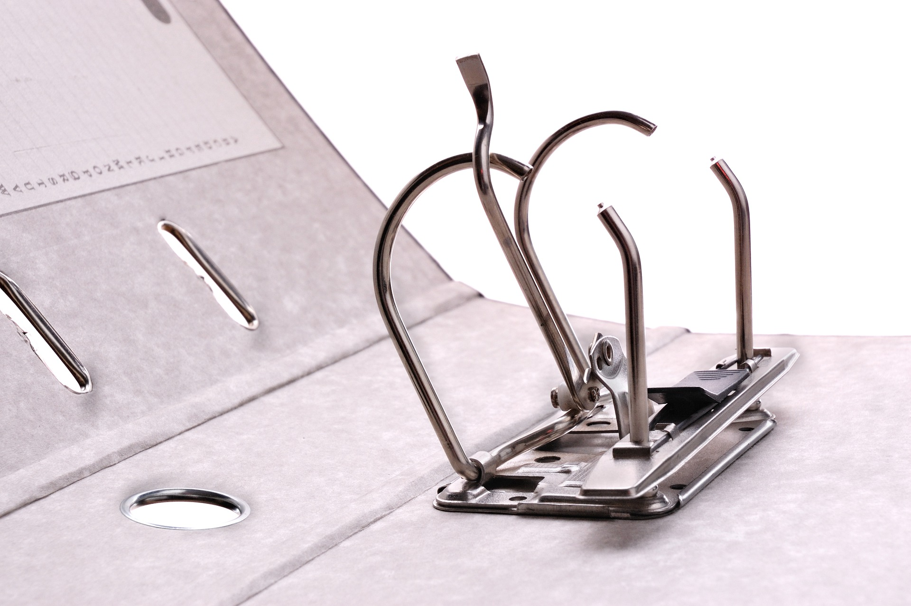

#  / Ordiclasseur

Ordiclasseur est un projet de système d'exploitation pour ordinateur papier. Concrètement l'ordinateur est un classeur contenant de simples feuilles écrites à la main.

Le stockage de l'information se fait sur papier, le traitement de l'information est fait manuellement par le propriétaire du classeur. Le système propose des procédures et des définitions formelles, des outils modernes d'organisation, de gestion des tâches, un langage de programmation personnelle, des applications, des jeux, et même une connectivité réseau par courrier postal.

## Raison d'être

J'énumère ici les différents objectifs du projet Ordiclasseur.

### Objectif 1 - Revenir à une technologie simple

La simplicité de la technologie utilisée ici est peut-être le plus important de tous les atouts d'un Ordiclasseur.

1. La simplicité, c'est la robustesse. *Le papier, ça reste.*
1. La charge cognitive est moindre. *Le papier c'est facile.*
1. L'outil n'absorbe pas l'utilisateur. *L'écriture est une activité corporelle.*
1. C'est mieux pour l'environnement. *Le papier se recycle.*
1. Le contact redevient humain. *Une correspondance épistolaire, c'est chaleureux.*

### Objectif 2 - Donner du sens

Un jour, nous allons rencontrer la mort. Il y aura un moment où il ne restera plus que quelques minutes ; puis un moment où il ne restera plus que quelques secondes ; puis le moment.

- Pour donner un sens à sa vie, il faut aider les autres à être heureux.
- Pour pouvoir aider les autres, il faut soi-même être heureux.
- Pour être heureux il faut pouvoir vivre pleinement l'instant présent.
- Pour vraiment vivre dans l'ici et le maintenant, il faut se libérer de l'avenir et du passé.
- Pour se libérer, dans notre monde complexe, il faut s'organiser et se discipliner.
    - Pour nous organiser, nous avons besoin d'un support fluide, adaptif et privé pour stocker l'information.
    - Pour nous discipliner nous avons besoin de méthodes claires, que nous choisissons en conscience.

### Objectif 3 - Agir vers une singularité spirituelle

Ordiclasseur s'intègre dans un cadre plus global d'avancée vers une "singularité" spirituelle.

La notion de singularité spirituelle s'entend *par opposition* au concept de [singularité technologique](https://fr.wikipedia.org/wiki/Singularit%C3%A9_technologique). Il s'agit d'un moment dans l'évolution de l'humanité, à partir duquel le degré de développement spirituel atteindra une masse critique telle que la société commencera à encourager les comportements altruistes plutôt qu'égoïstes, valorisera l'entraide plutôt que la compétition, ce qui augmentera de manière exponentielle la vitesse de notre évolution spirituelle, en un cercle vertueux.

Cette singularité spirituelle est accessible et nécessaire à notre survie. Elle ne sera pas laïque au sens où nulle religion n'y aurait sa place, mais au contraire ouverte et connectée à chaque religion, et à chaque sensibilité, car la diversité des religions et des philosophies humaines est un trésor que nous devons préserver.

C'est pourquoi Ordiclasseur est "compatible" avec toutes les religions et toutes les non-religions.

## Contributeurs

- Julien Laguerre

## Licence Creative Commons

Le projet Ordiclasseur est sous Licence Creative Commons [Attribution - Partage dans les Mêmes Conditions 4.0 International](http://creativecommons.org/licenses/by-sa/4.0/)

*Illustrations / [Pixabay](https://pixabay.com/service/license/)*

